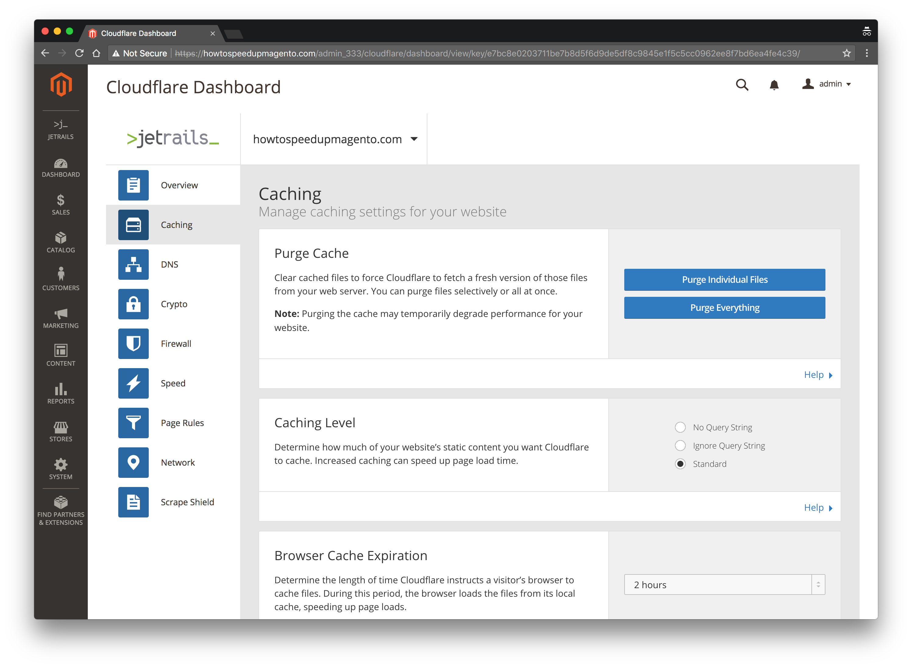

# Magento 2 — Cloudflare — By [JetRails](https://jetrails.com)
> Interact with popular Cloudflare features though Magento's backend portal.

	

## Documentation
The user guide can be found [here](https://learn.jetrails.com/article/magento-2-cloudflare-extension).  The user guide goes through the installation process as well as explains all the features that comes with this extension. For further support, please email [development@jetrails.com](mailto://development@jetrails.com).

## Build System
A simple [Makefile](Makefile) is used as a build system. Run `make help` to see available commands.

## Development
Run `make dev-create` to create a docker development environment using the [magento-cloud-docker](https://github.com/magento/magento-cloud-docker) project. Run `make dev-down` spin the environment down, `make dev-up` to spin it back up, and `make dev-nuke` to completely remove everything that is ephemeral.
